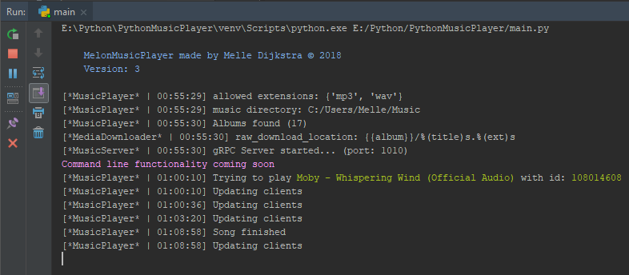

# Python Music Player

## Introduction

This repository contains a python music player which acts as a server. 
It uses the vlc python bindings to play the music and gRPC communication to communicate 
with the Android Application which can be found [here](https://github.com/MelleDijkstra/AndroidMusicPlayerClient)

## Installation

### Windows

Download executable from here
[Download link]()

__*! I experienced a bug with the windows executable, you sometimes need to press `enter`
to activate the server again !*__

Besides that, it should work fine ;)

### Linux (Debian | Raspberry Pi)

(coming soon, on my todo list)
I published a PyPi package, but I haven't tested it yet.
To install run the following command:
`pip install melon-music-player`

### From source

If you want to install/run the MelonMusicPlayer from source,
or if you want to develop on the current code base (please feel free)
run the following instructions:

- Make sure you have installed python 3.5 or higher. [Python Download](https://www.python.org/downloads/)
- The actual VLC (32/64 bit depending on your python version) program which can be found here ([VLC Download](http://www.videolan.org/vlc/)).
  
  **Windows**: For windows you can just install the executable
  
  **Linux**: For linux system it should be as easy as running `$ sudo apt-get install vlc`. 
  
  **!Although, check their site for correct installation!**

- Clone the project if you haven't already `$ git clone https://github.com/MelleDijkstra/PythonMusicPlayer`
- Go to cloned folder `$ cd PythonMusicPlayer`
- Then run `$ pip install -r requirements.txt` to install the packages needed
  
  (If you are installing the MelonMusicPlayer server on raspberry pi this process
  can take some time. The reason is because the server runs on gRPC which
  has to compile when installing for raspbian. This will hopefully be changed in the future (Please be patient!))

- Change any settings needed in `config.ini`. This is the configuration file for the server
- Start the music server by running `$ python main.py`. 
  
  Then use a client/controller to connect to the server.
  if you downloaded the source, there should be a `client.py`. Run this in another terminal/process to test the server.
  The client has quite some functionality but I will not be maintaining them. For full experience use one of the controllers
  like the [Android App](https://github.com/MelleDijkstra/AndroidMusicPlayerClient).

### TODO
(only server related tasks)

- [ ] Able to send an MRL link to server to download
- [ ] Handle all MediaDownloader RPC calls
- [ ] Create distributions for:
    - [x] Windows
    - [ ] Debian
    - [ ] Ubuntu
    - [ ] Mac OS
- [ ] Write good tests ;)
- [ ] Retrieve album covers from media files and send them
- [ ] Able to sync media files with clients/controllers
- [ ] SoundCloud support
- [ ] Store radio station urls in file and be able to stream them
- [x] gRPC implementation
- [x] Handle all MusicPlayer RPC calls (play, pause, ...)
- [x] Retrieve album & song list
- [x] Volume control
- [x] Queue music (next & previous song selection)
- [x] Write tests
